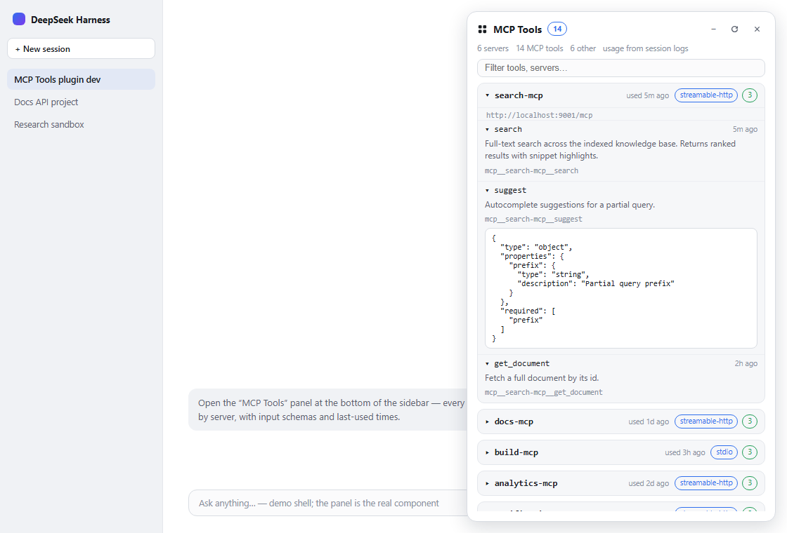
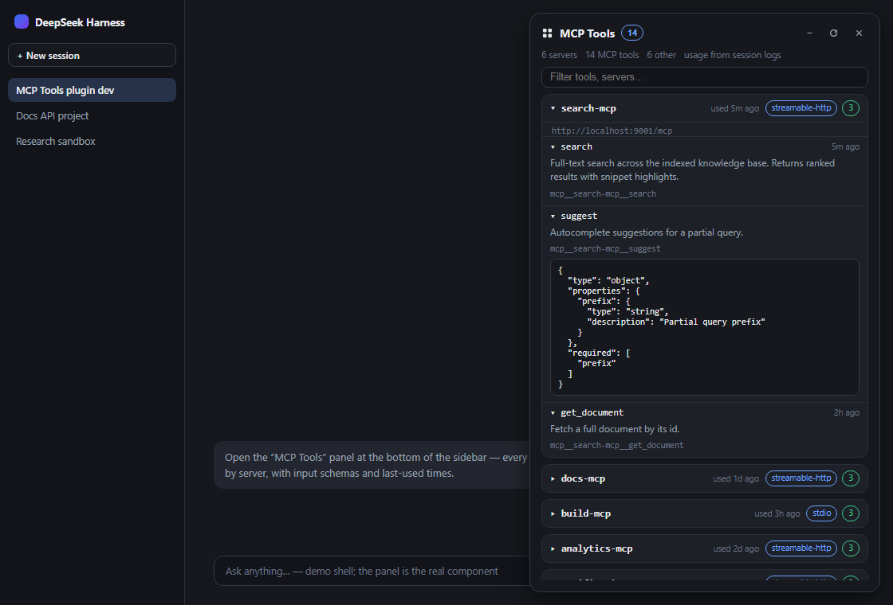
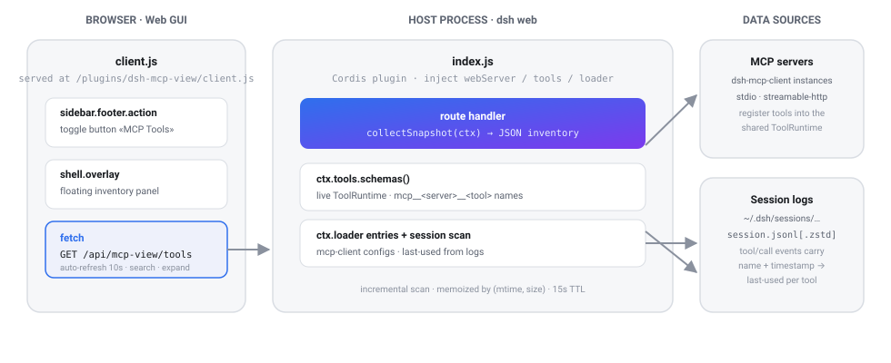

<div align="center">


# 🔌 dsh-mcp-view

### See every MCP server & tool in your DeepSeek Harness session — right in the Web GUI.

**English** · [中文](README.zh.md) · [Русский](README.ru.md)

[](LICENSE)
[](https://www.npmjs.com/package/dsh-mcp-view)
[](#)
[](#)
[](#)
[](#contributing)
[](https://github.com/beancookie/awesome-dsh-plugin)

*A floating MCP inventory panel for the DSH sidebar: servers grouped, tools with JSON schemas, live search, and **last-used times pulled from real session logs** — nothing invented.*

</div>

---



DSH runs your MCP servers (docs, build & analytics — whatever you have configured) and registers their tools into the shared `mcp__*` namespace — but there was **no UI to see them**. This plugin adds a one-click panel that answers: *what MCP servers are configured, which tools are registered, what their input schemas look like, and when each was last used.*

## ✨ Features

| | |
|---|---|
| 🖥 **All servers, one panel** | Every `dsh-mcp-client` instance in your profile, with transport (`stdio` / `streamable-http`) and endpoint (command or URL), plus connection state (active / disabled / no tools). |
| 🗂 **Collapsed by default** | Servers are folded into a single compact row; one click expands the tool list. `+` / `−` in the header expands or collapses everything. |
| 🧬 **Full JSON schemas** | Each tool shows its raw name, description and the exact `inputSchema` the model sees — expandable, prettified. |
| 🕘 **Last-used times** | Derived from real `tool/call` events in `~/.dsh/sessions/**/session.jsonl[.zstd]` — per tool *and* per server. If a tool was never used, no timestamp is shown (never fabricated). |
| 🔍 **Live search** | Filter by tool name, raw name, description or server; auto-refresh every 10 s plus a manual refresh button. |
| 🧩 **Non-MCP context** | A collapsible list of the other (built-in / plugin) globally-registered tools, so you can see the whole tool landscape at a glance. |

## 📸 Screenshots

| Light | Dark |
|---|---|
|  |  |

## ⚡ Quick start

```sh
git clone https://github.com/stopchewing/dsh-mcp-view.git
cd dsh-mcp-view
dsh plugin --profile web add link:$(pwd)
```

Then **restart `dsh web`** and refresh the page — a **「MCP Tools」** button appears at the bottom of the sidebar.

## 📦 Install

### From npm

```sh
dsh plugin --profile web add dsh-mcp-view
```

### From the repository

```sh
git clone https://github.com/stopchewing/dsh-mcp-view.git
dsh plugin --profile web add link:/absolute/path/to/dsh-mcp-view
```

### Manual (no CLI)

1. Put this package into the profile's `node_modules` (copy, or a junction on Windows):

   ```powershell
   New-Item -ItemType Junction -Path "$env:USERPROFILE\.dsh\profiles\web\node_modules\dsh-mcp-view" -Target "<abs-path>\dsh-mcp-view"
   ```

2. Append to `~/.dsh/profiles/web/cordis.patch.yml`:

   ```yaml
   - insert:
       - id: mcp-view
         name: 'dsh-mcp-view'
   ```

3. Restart `dsh web`, then **F5** the page.

> The profile patch is watched, so the host half activates live; the client bundle is served fresh at `/plugins/dsh-mcp-view/client.js` — a page refresh is all the browser needs.

## 🎛 Usage

1. Click **「MCP Tools」** in the sidebar footer (icon-only when the sidebar is collapsed).
2. Browse servers — each row shows transport, tool count and last use; click to expand tools.
3. Click a tool to see its description, full public name and JSON input schema.
4. Type in the filter box to narrow tools and servers; `Esc` or ✕ closes the panel.

## 🗺 Architecture



| Half | File | Role |
|---|---|---|
| **Host** | `lib/index.js` | `GET /api/mcp-view/tools` returns the JSON inventory: MCP instances from the Cordis loader, live tool schemas from `ctx.tools`, and last-use history scanned from session logs (incremental scan memoized by file mtime/size, 15 s TTL). |
| **Browser** | `lib/client.js` | Client plugin bundle: registers the sidebar toggle in the `sidebar.footer.action` slot and the floating panel in the `shell.overlay` slot. |

No changes to dsh sources — it is a hot-pluggable profile plugin, same mechanism as the `@linxin666` web-ui family.

## 🔒 Security & privacy

- **Local-only.** Everything runs in your dsh host process and browser; the only network traffic is to the MCP servers *you already configured*.
- **No telemetry, no analytics, no external calls** — the panel never leaves your machine.
- The `/api/mcp-view/tools` route is served by the same-origin webserver; it is **read-only** — it cannot call MCP tools, only list them.
- Last-used times come from your own session logs on disk; nothing is sent anywhere.
- Passwords / credentials of your MCP servers are **never** exposed — only transport type and endpoint URL.

## 🧩 Compatibility

- `@deepseek-ai/dsh` `0.1.0-rc.6` (web profile) — same cadence as the ecosystem's pinned SDK versions.
- Node `^22.19.0 || >=24.0.0` (the dsh runtime requirement — zstd session decoding is used).
- Browser: Chrome / Edge / Firefox (React 18, no build step for the client bundle).

## ❓ FAQ

**Are MCP servers per-session or shared?**
Shared. MCP servers are configured once at the profile level (`cordis.patch.yml`), connect once per process, and register their tools into the process-wide `ToolRuntime` — every session and workspace sees the same set. A session whose agent preset restricts tools may hide them *from the model*, but the registry stays global.

**Where does «used …» come from?**
From `tool/call` events in your persisted session logs (`~/.dsh/sessions`). It is the real dispatch timestamp of the last call of that tool. If the log has no calls for a tool, the hint is simply absent.

**Why are only some tools listed under "Other tools"?**
The panel shows the *global* registry. Per-session agent tools (e.g. `pwsh`, `read`) register in the session's scope layer, so they are not part of the global view.

**Does the panel slow things down?**
No. The session scan is incremental (only changed files are re-read) and rate-limited to once per 15 s; the browser auto-refresh is 10 s.

## 🛠 Development

```
dsh-mcp-view/
├─ lib/
│  ├─ index.js      # host plugin: route + inventory + session scan
│  └─ client.js     # browser bundle (window.__ModuleLoader__)
├─ cordis.patch.yml # profile roster insert
├─ docs/            # preview data, template, screenshots, architecture
└─ package.json     # dsh.bundle.patch + dsh.client manifest
```

Rebuild the README preview screenshots (requires Chrome):

```sh
# 1. merge live inventory + session scan into docs/preview.html
#    (docs/preview-data.json + docs/preview.template.html → docs/preview.html)
# 2. screenshot with headless Chrome:
chrome --headless=new --screenshot=docs/screenshots/panel-light.png --window-size=1120,760 "file:///abs/path/docs/preview.html?theme=light"
#    repeat with ?theme=dark
```

## 🤝 Contributing

Found a bug, want a new view (per-session visibility, tool stats, dark-mode polish)? Open an [issue](https://github.com/stopchewing/dsh-mcp-view/issues) or send a PR — they're welcome.

**Star ⭐ this repo if the panel made your MCP tooling visible** — it helps other DSH users find it (and it keeps the maintainers motivated). After your first release, submit it to [awesome-dsh-plugin](https://github.com/beancookie/awesome-dsh-plugin) and [awesome-deepseek-harness](https://github.com/Dominic789654/awesome-deepseek-harness) to reach the whole ecosystem.

## 📜 License

[MIT](LICENSE) © 2026 stopchewing

---

<div align="center"><sub>Not an official DeepSeek product — a community plugin for <a href="https://github.com/deepseek-ai/deepseek-harness">DeepSeek Harness</a>.</sub></div>
