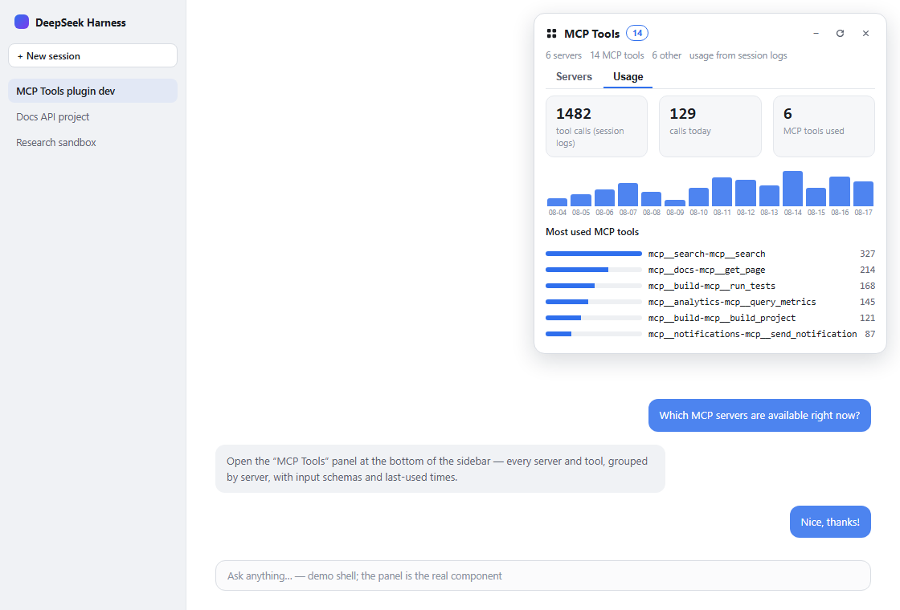
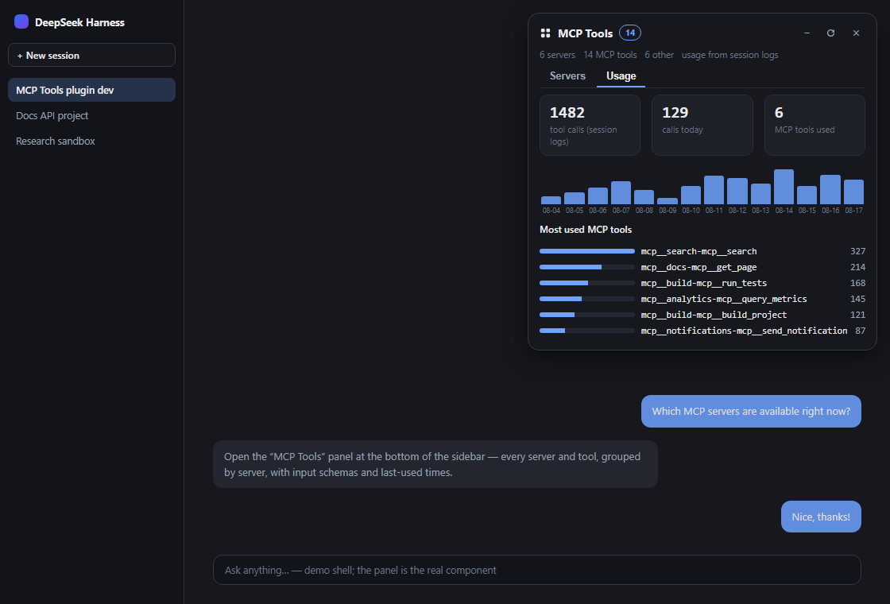

<div align="center">


# 🔌 dsh-mcp-view

### Видите все MCP-серверы и инструменты вашей сессии DeepSeek Harness — прямо в Web GUI.

**Русский** · [English](README.md) · [中文](README.zh.md)

[](LICENSE)
[](https://www.npmjs.com/package/dsh-mcp-view)
[](#)
[](#)
[](#)
[](#contributing)
[](https://github.com/beancookie/awesome-dsh-plugin)

*Плавающая панель-инвентарь MCP для сайдбара DSH: серверы сгруппированы, у инструментов — JSON-схемы, живой поиск и **время последнего использования из реальных логов сессий** — ничего выдуманного.*

</div>

---


DSH запускает ваши MCP-серверы (документация, сборка, аналитика — любые, что вы настроили) и регистрирует их инструменты в общем пространстве имён `mcp__*` — но **не было UI, чтобы их увидеть**. Этот плагин добавляет панель в один клик, которая отвечает: *какие MCP-серверы настроены, какие инструменты зарегистрированы, как выглядят их схемы входных параметров и когда каждый использовался в последний раз.*

## ✨ Возможности

| | |
|---|---|
| 🖥 **Все серверы в одной панели** | Каждый экземпляр `dsh-mcp-client` из вашего профиля: транспорт (`stdio` / `streamable-http`) и endpoint (команда или URL), плюс состояние подключения (активен / отключён / нет инструментов). |
| 🗂 **Свёрнуто по умолчанию** | Серверы складываются в одну компактную строку; клик раскрывает список инструментов. `+` / `−` в шапке разворачивает или сворачивает всё сразу. |
| 🧬 **Полные JSON-схемы** | У каждого инструмента — исходное имя, описание и точный `inputSchema`, который видит модель; раскрывается и красиво форматируется. |
| 🕘 **Последнее использование и статистика** | Из событий `tool/call` в `~/.dsh/sessions/**/session.jsonl[.zstd]` — на инструмент и сервер, плюс вкладка **Usage**: всего вызовов, график по дням, самые частые инструменты. |
| 🔍 **Живой поиск** | Фильтр по имени инструмента, исходному имени, описанию, серверу **или именам параметров**; автообновление каждые 10 с плюс кнопка ручного обновления. |
| 🎯 **Режим «текущая сессия»** | Переключатель: показывать только инструменты, которые реально видит агент текущей сессии (по scope агента сессии). |
| ❤️ **Избранное и сортировка** | Звёзды для серверов/инструментов; сортировка по имени / числу инструментов / последнему использованию / избранному; состояние в `localStorage`. |
| ⚕️ **Проверка здоровья** | Кнопка: probe streamable-http эндпоинтов (HEAD) → бейдж up/down на сервере. |
| 📤 **Экспорт** | Скачивание всего инвентаря в JSON или Markdown. |
| 🧩 **Контекст не-MCP инструментов** | Сворачиваемый список остальных глобально зарегистрированных инструментов (встроенных / плагинных) — вся картина инструментов в одном взгляде. |

## 📸 Скриншоты

| | Светлая тема | Тёмная тема |
|---|---|---|
| **Servers** |  |  |
| **Usage** |  |  |

## ⚡ Быстрый старт

```sh
git clone https://github.com/stopchewing/dsh-mcp-view.git
cd dsh-mcp-view
dsh plugin --profile web add link:$(pwd)
```

Затем **перезапустите `dsh web`** и обновите страницу — внизу сайдбара появится кнопка **「MCP Tools」**.

## 📦 Установка

### Из npm

```sh
dsh plugin --profile web add dsh-mcp-view
```

### Из репозитория

```sh
git clone https://github.com/stopchewing/dsh-mcp-view.git
dsh plugin --profile web add link:/absolute/path/to/dsh-mcp-view
```

### Вручную (без CLI)

1. Поместите пакет в `node_modules` профиля (копией или junction на Windows):

   ```powershell
   New-Item -ItemType Junction -Path "$env:USERPROFILE\.dsh\profiles\web\node_modules\dsh-mcp-view" -Target "<abs-path>\dsh-mcp-view"
   ```

2. Добавьте в конец `~/.dsh/profiles/web/cordis.patch.yml`:

   ```yaml
   - insert:
       - id: mcp-view
         name: 'dsh-mcp-view'
   ```

3. Перезапустите `dsh web` и нажмите **F5**.

> Файл патча профиля отслеживается, поэтому host-половина активируется «на лету»; client-бандл отдаётся свежим по `/plugins/dsh-mcp-view/client.js` — браузеру достаточно одного обновления страницы.

## ⚙️ Конфигурация

Плагин принимает необязательный объект `config` на своей строке в `cordis.patch.yml`:

```yaml
- insert:
    - id: mcp-view
      name: 'dsh-mcp-view'
      config:
        enabled: true          # мастер-выключатель (по умолчанию true)
        announceToAgent: true  # анонсировать плагин в промпте агента (по умолчанию true)
```

## 🎛 Использование

1. Нажмите **「MCP Tools」** внизу сайдбара (только иконка, если сайдбар свёрнут).
2. Смотрите серверы — в строке транспорт, число инструментов и последнее использование; клик раскрывает инструменты.
3. Клик по инструменту — описание, полное публичное имя и JSON-схема входных параметров.
4. Фильтр в поле поиска сужает список; `Esc` или ✕ закрывают панель.

## 🗺 Архитектура


| Половина | Файл | Роль |
|---|---|---|
| **Host** | `lib/index.js` | `GET /api/mcp-view/tools` возвращает JSON-инвентарь: MCP-инстансы из Cordis loader, живые схемы инструментов из `ctx.tools` и историю последних использований из логов сессий (инкрементальное сканирование по mtime/size файлов, TTL 15 с). |
| **Browser** | `lib/client.js` | Клиентский бандл плагина: регистрирует переключатель в слоте `sidebar.footer.action` и плавающую панель в слоте `shell.overlay`. |

Без изменений исходников dsh — это горячо подключаемый profile-плагин, тот же механизм, что и у семейства `@linxin666` web-ui.

## 🔒 Безопасность и приватность

- **Только локально.** Всё работает в вашем host-процессе dsh и браузере; единственный сетевой трафик — к MCP-серверам, которые *вы сами настроили*.
- **Никакой телеметрии, аналитики и внешних вызовов** — панель не покидает вашу машину.
- Роут `/api/mcp-view/tools` отдаётся same-origin веб-сервером и **только читает** — он не может вызывать MCP-инструменты, только перечислять их.
- Время последнего использования берётся из ваших локальных логов сессий; никуда не отправляется.
- Пароли / учётные данные MCP-серверов **никогда** не раскрываются — только тип транспорта и URL эндпоинта.

## 🧩 Совместимость

- `@deepseek-ai/dsh` `0.1.0-rc.6` (web profile) — та же ритмика, что и у фиксированных версий SDK в экосистеме.
- Node `^22.19.0 || >=24.0.0` (требование рантайма dsh — используется zstd-декодирование сессий).
- Браузеры: Chrome / Edge / Firefox (React 18, клиентский бандл без шага сборки).

## ❓ FAQ

**MCP-серверы общие для сессий или у каждой свои?**
Общие. Серверы настраиваются один раз на уровне профиля (`cordis.patch.yml`), подключаются один раз на процесс и регистрируют инструменты в общепроцессный `ToolRuntime` — все сессии и воркспейсы видят один и тот же набор. Если пресет агента сессии ограничивает инструменты, он может скрыть их *от модели*, но реестр остаётся глобальным.

**Откуда берётся «used …»?**
Из событий `tool/call` в сохранённых логах сессий (`~/.dsh/sessions`) — реальная метка времени последнего вызова инструмента. Если в логах вызовов нет, подсказка просто отсутствует.

**Почему в «Other tools» только часть инструментов?**
Панель показывает *глобальный* реестр. Инструменты агента, регистрируемые на сессию (например, `pwsh`, `read`), живут в scope-слое сессии и в глобальный обзор не входят.

**Панель не тормозит?**
Нет. Сканирование сессий инкрементальное (перечитываются только изменённые файлы) и ограничено разом в 15 с; автообновление в браузере — раз в 10 с.

## 🛠 Разработка

```
dsh-mcp-view/
├─ src/
│  └─ index.ts      # host-плагин (TypeScript): роут + инвентарь + скан сессий
├─ lib/
│  ├─ index.js      # скомпилированный host (npm run build)
│  └─ client.js     # браузерный бандл (window.__ModuleLoader__)
├─ test/            # node --test unit-тесты
├─ cordis.patch.yml # вставка в реестр профиля
├─ docs/            # данные превью, шаблон, скриншоты, архитектура
└─ package.json     # манифест dsh.bundle.patch + dsh.client
```

Host-плагин написан на TypeScript (`src/index.ts`); компилируется командой
`npm run build` (выдаёт `lib/index.js` + типы). Браузерный бандл
(`lib/client.js`) использует формат модулей DSH и ведётся как проверенный
JS-бандл. Локально запускай `npm test` (встроенный тест-раннер Node) и
`npm run typecheck`.

Пересборка скриншотов превью для README (нужен Chrome):

```sh
# 1. слить данные в docs/preview.html
#    (node docs/build-preview.mjs из preview-data.json + preview.template.html)
# 2. скриншот через headless Chrome (?view=servers — серверы / ?view=usage — статистика):
chrome --headless=new --screenshot=docs/screenshots/panel-light.png --window-size=1120,760 "file:///abs/path/docs/preview.html?view=servers&theme=light"
chrome --headless=new --screenshot=docs/screenshots/panel-usage-light.png --window-size=1120,760 "file:///abs/path/docs/preview.html?view=usage&theme=light"
#    для тёмной темы — параметр theme=dark
```

## 🤝 Вклад в проект

Нашли баг или хотите новый вид (видимость по сессиям, статистика инструментов, полировка тёмной темы)? Откройте [issue](https://github.com/stopchewing/dsh-mcp-view/issues) или пришлите PR — приветствуются.

**Поставьте ⭐ этому репозиторию, если панель сделала ваши MCP-инструменты видимыми** — это помогает другим пользователям DSH найти её (и мотивирует поддерживать проект). После первого релиза добавьте его в [awesome-dsh-plugin](https://github.com/beancookie/awesome-dsh-plugin) и [awesome-deepseek-harness](https://github.com/Dominic789654/awesome-deepseek-harness), чтобы охватить всю экосистему.

## 📜 Лицензия

[MIT](LICENSE) © 2026 stopchewing

---

<div align="center"><sub>Не официальный продукт DeepSeek — сообщественный плагин для <a href="https://github.com/deepseek-ai/deepseek-harness">DeepSeek Harness</a>.</sub></div>
